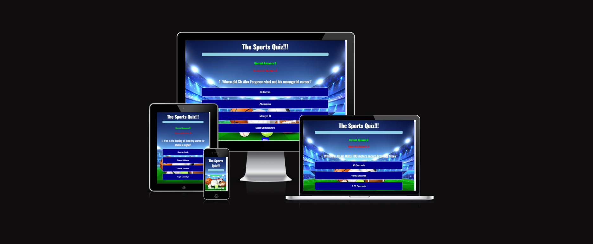
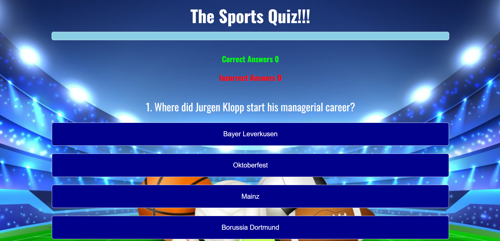
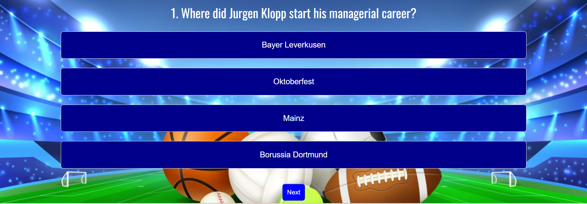
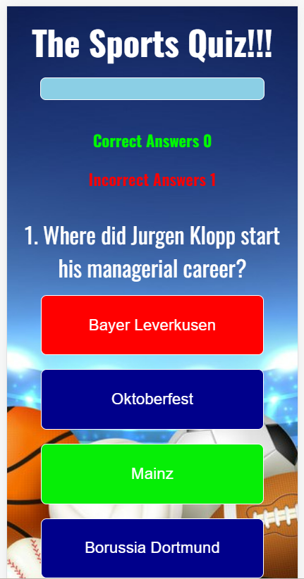

# The Sports Quiz

The sports quiz is designed to be a responsive website allowing visitors to view on a range of devices. It allows visitors to test there knowledge on the world of sport.

The Sports Quiz was created as my second milestone project for the Code Institute Level 5 Diploma in Web Application Development.

Link to deployed site:  https://sam2829.github.io/project-2-sports-quiz/ 

## Contents

- [The Sports Quiz](#the-sports-quiz)
  - [Contents](#contents)
  - [Project Goals](#project-goals)
  - [Design](#design)
    - [Imagery](#imagery)
    - [Wireframes](#wireframes)
  - [Features](#features)
  - [Technologies Used](#technologies-used)
    - [Languages Used](#languages-used)
    - [Frameworks \& Programs Used](#frameworks--programs-used)
  - [Deployment](#deployment)
  - [Testing](#testing)
    - [W3C Validator](#w3c-validator)
    - [Lighthouse](#lighthouse)
    - [Full Testing](#full-testing)
  - [Credits](#credits)

## Project Goals

* To be able to view the website on a range of devices.

* To be able to test your knowledge on the world of sport and having fun at the same time.

* To be able to easily navigate your way through the quiz.

## Design

### Imagery

The background image is to clearly show that you are invilved in the world of sport whilst taking part in the quiz. I have credited this image in the credits section.

### Wireframes

Wireframes were created for both desktop and mobile devices.

Desktop:

Mobile:

## Features

This website consists of two page. Main page where the quiz will be carried out and a completion page presenting your score.

Main Page:

* A background image displaying the a sporting theme.

* A clear heading of the webpage.

* A progress bar showing what stages your at through out the quiz.

* Scores keeping count of how many correct and incorrect answers you've made.

* Question clearly displayed and what number question it is.

* A selection of 4 answers to the question.

* A next button which will aloow you to continue to the next question.

Main page desktop screenshot 1:

Main page desktop screenshot 2:

Main page mobile screenshot:

Completion Page:

* A background image displaying the a sporting theme.
  
* A clear heading of the webpage.
  
* A progress bar showing what stages your at through out the quiz.

* Scores keeping count of how many correct and incorrect answers you've made.

* A congratulations message displaying your final score.

* A play again button if you wish to take part in the quiz again.

## Technologies Used

### Languages Used

HTML, CSS and JavaScript were used to create this site.

### Frameworks & Programs Used

* Balsamiq - Used to create the wireframes.

* Github - To save and store the files for the website.

* Google Fonts - To import the fonts used for this website.

* Favicon

## Deployment

Github Pages was used to deploy the live website. To do this are as followed:

1. Log in to GUthub.

2. Find the repository for this project, project 2 sports quiz.

3. Navigate to the settings tab.

4. Click on the pages link, in the list on the left-hand side of the page.

5. Scroll down to branch and in the drop-down box select branch main. then click save.

6. Refresh the page and at the top the link to the website shpuld be provided.

## Testing

Throughout the build of this project testing was an ongoing process mainly using Chrome Developer. This helped me with any alignment issues or any other styling issues i may have had.

An issues i did have was the correct and incorrect score displays were hard to see when originally positioned at the bottom of the page, due to the background image. The scores were then moved to the top of the page and alot more visible.

I have also checked that this project is responsive, looks good and functions on standard screen sizes using the devtools device toolbar.

I have tested that the page works in different browsers: Chrome, Firefox, Microsoft Edge.

### W3C Validator

The W3C Validator was used to validate the html and css files for this website. This was done via direct input method.

* HTHML - No errors or warnings found.
* CSS - No errors or warnings found.

### Lighthouse

I used Lighthouse within the Chrome Developer Tools to test for accessibility of the website:

### Full Testing

## Credits
