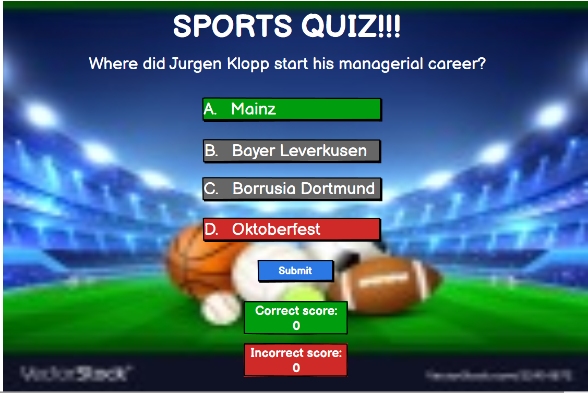
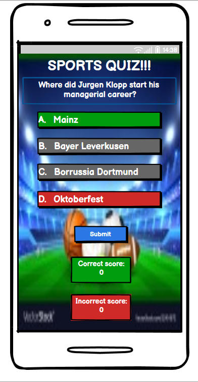
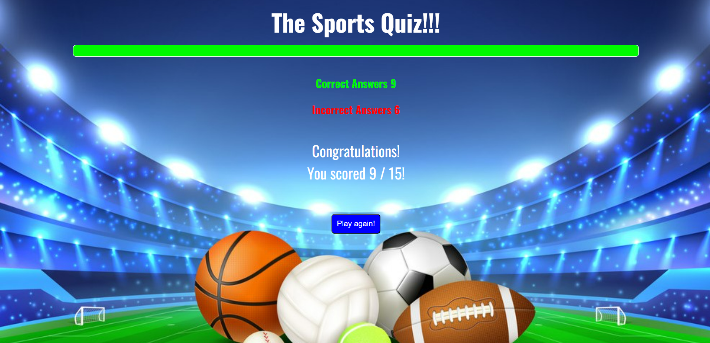
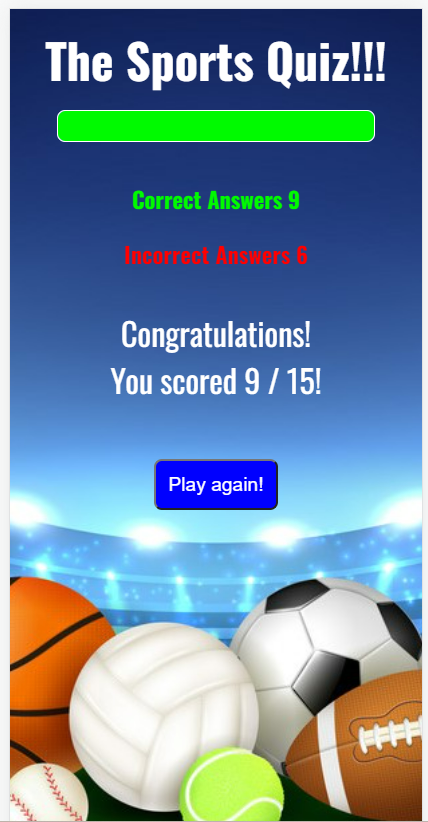
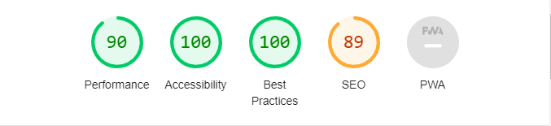
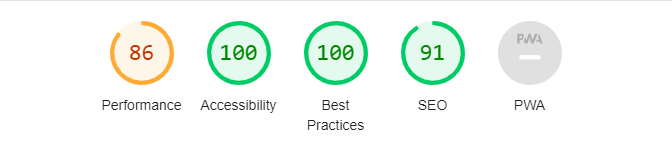
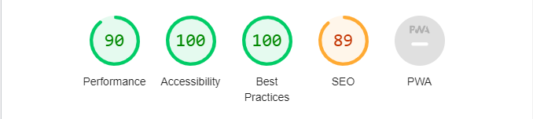
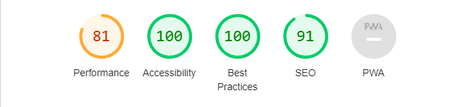

# The Sports Quiz

The sports quiz is designed to be a responsive website allowing visitors to view on a range of devices. It allows visitors to test there knowledge on the world of sport.

The Sports Quiz was created as my second milestone project for the Code Institute Level 5 Diploma in Web Application Development.

Link to deployed site:  https://sam2829.github.io/project-2-sports-quiz/ 

## Contents

- [The Sports Quiz](#the-sports-quiz)
  - [Contents](#contents)
  - [Project Goals](#project-goals)
  - [Design](#design)
    - [Imagery](#imagery)
    - [Wireframes](#wireframes)
  - [Features](#features)
  - [Technologies Used](#technologies-used)
    - [Languages Used](#languages-used)
    - [Frameworks \& Programs Used](#frameworks--programs-used)
  - [Deployment](#deployment)
  - [Testing](#testing)
    - [W3C Validator](#w3c-validator)
    - [Lighthouse](#lighthouse)
    - [Full Testing](#full-testing)
  - [Credits](#credits)
    - [Content](#content)
        - [JavaScript](#javascript)
    - [Media](#media)

## Project Goals

* To be able to view the website on a range of devices.

* To be able to test your knowledge on the world of sport and having fun at the same time.

* To be able to easily navigate your way through the quiz.

## Design

### Imagery

The background image is to clearly show that you are invilved in the world of sport whilst taking part in the quiz. I have credited this image in the credits section.

### Wireframes

Wireframes were created for both desktop and mobile devices.

Desktop:

Mobile:

## Features

This website consists of two page. Main page where the quiz will be carried out and a completion page presenting your score.

Main Page:

* A background image displaying the a sporting theme.

* A clear heading of the webpage.

* A progress bar showing what stages your at through out the quiz.

* Scores keeping count of how many correct and incorrect answers you've made.

* Question clearly displayed and what number question it is.

* A selection of 4 answers to the question.

* A next button which will aloow you to continue to the next question.

Main page desktop screenshot 1:

Main page desktop screenshot 2:

Main page mobile screenshot:

Completion Page:

* A background image displaying the a sporting theme.
  
* A clear heading of the webpage.
  
* A progress bar showing what stages your at through out the quiz.

* Scores keeping count of how many correct and incorrect answers you've made.

* A congratulations message displaying your final score.

* A play again button if you wish to take part in the quiz again.

Quiz complete page desktop screenshot:

Quiz complete page mobile screenshot:

## Technologies Used

### Languages Used

HTML, CSS and JavaScript were used to create this site.

### Frameworks & Programs Used

* Balsamiq - Used to create the wireframes.

* Github - To save and store the files for the website.

* Google Fonts - To import the fonts used for this website.

* Favicon.io - Used to get Favicon for this website.

## Deployment

Github Pages was used to deploy the live website. To do this are as followed:

1. Log in to GUthub.

2. Find the repository for this project, project 2 sports quiz.

3. Navigate to the settings tab.

4. Click on the pages link, in the list on the left-hand side of the page.

5. Scroll down to branch and in the drop-down box select branch main. then click save.

6. Refresh the page and at the top the link to the website shpuld be provided.

## Testing

Throughout the build of this project testing was an ongoing process mainly using Chrome Developer. This helped me with any alignment issues or any other styling issues i may have had.

An issues i did have was the correct and incorrect score displays were hard to see when originally positioned at the bottom of the page, due to the background image. The scores were then moved to the top of the page and alot more visible.

I have also checked that this project is responsive, looks good and functions on standard screen sizes using the devtools device toolbar.

I have tested that the page works in different browsers: Chrome, Firefox, Microsoft Edge.

### W3C Validator

The W3C Validator was used to validate the html and css files for this website. This was done via direct input method.

* HTHML - No errors or warnings found.
* CSS - No errors or warnings found.

### Lighthouse

I used Lighthouse within the Chrome Developer Tools to test for accessibility of the website.

Main page desktop screenshot:

Main page mobile scrrenshot:

Quiz complete page desktop screenshot:

Quiz complete page mobile screenshot:

### Full Testing

| Feature | Expected Outcome | Testing Performed | Result | Pass / Fail |
|---|---|---|---|---|
| Randomise Questions | Each time the website is refreshed the questions to appear in a different random order. | First go on to the website, think continually refresh the page to see if questions appear in different order. | Questions appear in different order. | Pass |
| Hover Over Buttons | When the mouse hovers over the answers buttons, next button or submit button the background color will change to aqua. | Hovered the mouse over all the buttons. | Background color on all buttons change to aqua when hovered over. | Pass |
| Selected Answer Correct or Incoreect | Each time you select an answer button, if correct that anser will change color to green. If incorrect selected answer will change to red and the correct answer will change to green. | Selected answers that were correct and incorrect throughout the quiz to check this works. | Correct answers changed to green. Incorrect answers changed to red whilst showing the correct answer in green. | Pass |
| Answer Selected Turs Off Answer Button and Hover | Once you have selected an answer when the mouse cursor hovers over the answer button or another answer button the background color will no longer change to aqua and unable to select another answer. | Selected answers throughout the quiz to see if the hover class turned off and tried cslecting different answers. | The Hover background color change no longer applied and i was unable to select a different answer. | Pass |
| Disable Next Button | The next button will only take you to the next question when you have selected an answer to the current question. | Tried clicking next to take me to the next question without selecting an answer. It would not go to the next question until i answered the current question. | Next button would not let me go to the next question until current question answered. | Pass |
| Correct Score | When you get a correct answer the correct score should increment up by one each time. | Selected the correct answer throughout the quiz and watched the correct score increment up by one each time. | Correct score incremented up by 1 with every correct answer. | Pass |
| Incorrect Score | When you get a incorrect answer the incorrect score should increment up by one each time. | Selected the incorrect answer throughout the quiz and watched the incorrect score increment up by one each time. | Incorrect score incremented up by 1 with every incorrect answer. | Pass |
| 15 Questions each time | Each time you go through the quiz you should be asked 15 different questions. | Played the quiz several times to make sure each time i was asked 15 questions and the questions didnt repeat themselves in the same quiz. | 15 questions were displayed each time and werent repeated in the same quiz. | Pass |
| Progress Bar | Progress bar fills up as you make your way through the quiz and is full on completion. | Played the quiz several times and looked for progress bar to make its way to full. | Progress bar begins empty and fills up with every question, up to full when quiz is complete. | Pass |
| Congratulations Message | Congratulations message along with your final score is displayed upon completion of the quiz. | Completed the quiz several times. | When completing the quiz congratualtions is displayed along with my final score. | Pass |
| Play Again Button | When the quiz is complete the play again button should appear and when clicked take you back to the start of the quiz. | Completed the quiz several times to check play again button appears and takes me to the start of the quiz. | When the quiz is complete the play agin button appears and when clicked takes me back to the start of the quiz. | Pass |
| Answers and Questions no Longer Display | On completion of the quiz there should be no questions or answers being displayed. | Completed the quiz several times to see if there is any questions or answers being displayed. | Upon completing the quiz the questions and answers were no longer displayed. | Pass |

## Credits

### Content

##### JavaScript

* JavaScript code for the progress bar was taken from trevthedev777 github for quiz game, which came up when I googled how to make a progress bar in javascript.
- Watched tutorial on how to make a quiz game on youtube which i found was very helpful. <https://www.youtube.com/watch?v=riDzcEQbX6k>

### Media

* Background image for this project was taken from Google Images.
* All questions and answers were found using Google.
* Google Fonts was used to import the fonts for this website.
* Favicon.io was used to import the Favicon for this website.
